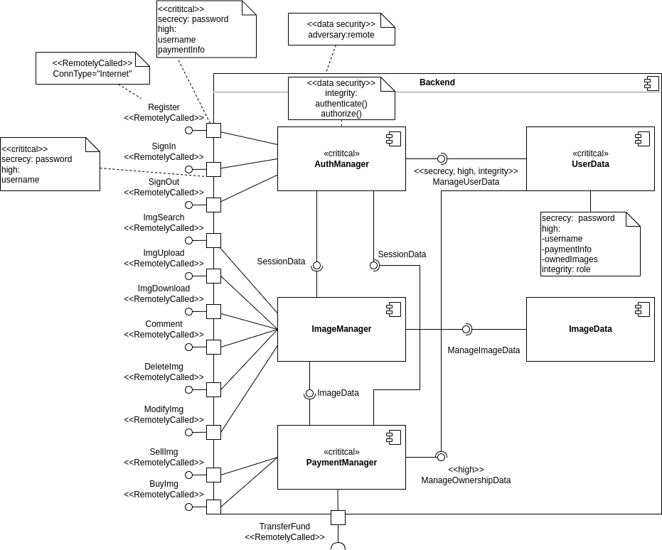
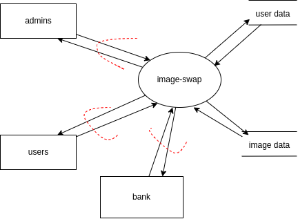
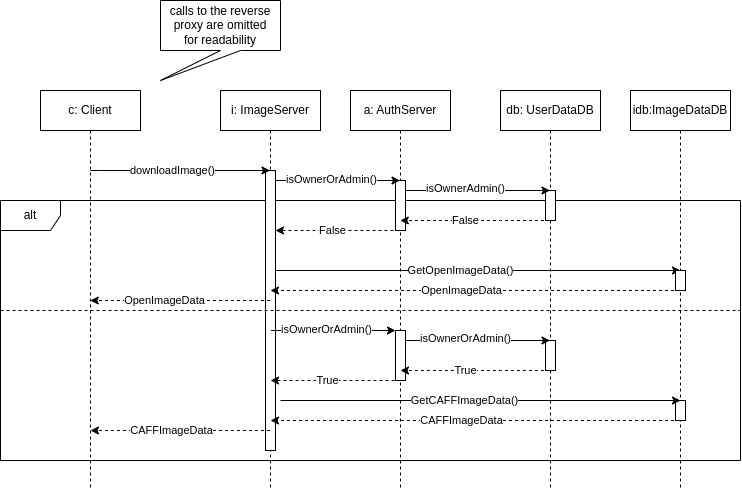

# Software security HW - image-swap

*Author: Debreczeni Máté*

## Task

The task involves designing a web application. The aim of the project is to
to apply the methods learned in practice, for a safety-critical software
development of a security software. The work will include executing tasks 
related to the requirements and design phases. Design an online store
to browse and buy animated images in a custom format. The software must 
support CIFF and CAFF formats. The complete system must include a remote 
service reachable via HTTP(S) he complete system must include a remote service 
reachable via HTTP(S) and the associated web or mobile client.

## Functional requirements

The application must be able to implement the following functions:
- Users must be able to register and log in.
- Users must be able to upload, purchase (or re-download), search for CAFF files.
- Users must be able to add comments to a CAFF file.

The application must support the following types of users:
- the system should have a "regular" user who can use the general functions.
- the system should have an administrator user who can enter user and product data
The system must have an administrator who can modify and delete product and product data.

Application architecture requirements:
- the system must have a server-side component that can serve the user's
requests.
- the system must be able to support mobile and/or web clients

## Requirements

The following section will contain my solution to the task.

### CIA+AAA

#### Confidentiality

- Users can only access their own payment info.
- Users can only purchase images for themselves.

#### Integrity

- Administrators can edit or delete the details of images uploaded by users.
- Users can view and edit the details of images they have uploaded. 
- The integrity of uploaded CAFF files must be validated

#### Availability

- Users can view and download all images in an open format.
- Users can view and download all images they own in CAFF format.
- Administrators can view and download all images.

#### Authentication

- Users can create and register a simple account.
- Users must provide an adequetly complex password upon registration.
- Administrator accounts are created at deployment.
- No user identification is required to view or download images in an open format.
- In order to access functions besides downloading and viewing open-format images, logging in is required.
- Following a successful login users are given a unique session id.
- Followin a logout, the user's active session id is invalidated.

#### Authorization

- Functions available without a role: view and download open-format images.
- Functions accessible with user role: buy and sell images, upload and download images (owned ones in CAFF format)
- Functions accessible with admin role: buy and sell images, upload and download images, edit and delete image data (in all formats)

#### Auditing

- Logging in/out and registration of users is logged
- Upload events of images are logged.
- Writing, deleting and editing comments are logged.
- Payment events are logged with the corresponding userId, but no payment info.

### Stride threat modelling

#### Spoofing:

- Attackers might try to impersonate a legitimate user to gain access to their payment information.
- Attackers might try to impersonate a legitimate user to sell their owned images to themselves.
 
#### Tampering:
 
- Attackers might try to modify the CAFF or CIFF files during upload to include malicious code in the meta-data.
- Attackers might try to modify the meta-data associated with the files to misrepresent their contents.
 
#### Repudiation:
 
- Attackers might deny that they uploaded or purchased specific images.
- Attackers might deny that they made specific comments on an image.
- Attackers might deny that they received the money for sold images.
 
#### Information Disclosure:
 
- Attackers might try to access and steal sensitive user data, such as login credentials, personal information, and payment information via injection attacks against the AuthServer.
- Attackers might try to gain access payment information by MITM attacking the paymentServer and the Bank.
 
#### Denial of Service:
 
- Attackers might try to overload the servers by making too many requests.
- Attackers might try to flood the system with uploaded images and comments.
- Attackers might try to trade pictures between themselves to bring the servers down.
 
#### Elevation of Privilege:
 
- Attackers might try to gain admin privileges via injection attacks against the AuthServer.

### Use case diagrams

#### Administrator

#### Regular user

### Component diagrams

#### Backend

#### Frontend

### System boundary and Data flow diagrams

#### System boundary diagram

#### Data flow diagram

### Sequence Diagrams

All events are logged according to the security requirements, but the logging calls are omitted for readability.

#### Download image

#### User registration

#### Image purchase

### Security Test Plan

#### User privilige tests:
- Test that "regular" users can only access the functions they are allowed to access and cannot modify or delete data.
- Check that administrators are only allowed to modify or delete users and products that they have authorised.
- Test that users cannot gain unauthorised access to data or functions stored in the system.

#### Input validation tests:
- Test that the application correctly handles user input and prevents SQL injection and cross-site scripting (XSS) attacks.
- Check that the size and type of uploaded files meet the specified restrictions and do not contain malicious code.
- Test that the application handles incorrect input and displays appropriate error messages to users.

#### Server-side security tests:
- Test that the application properly handles errors and does not allow access from unauthorized users.
- Test that the application properly restricts access to the database and does not allow unauthorized users to modify or delete data.
- Check server-side configuration and settings to ensure that the application is properly protected from phishing, attacks and other security threats.

#### Mobile and web client tests:
- Test that clients handle data and user interactions properly.
Check that clients are not sending sensitive data to the server, such as passwords in cleartext or personal information.
- Test that clients are using encryption and SSL/TLS properly when communicating with the server.
